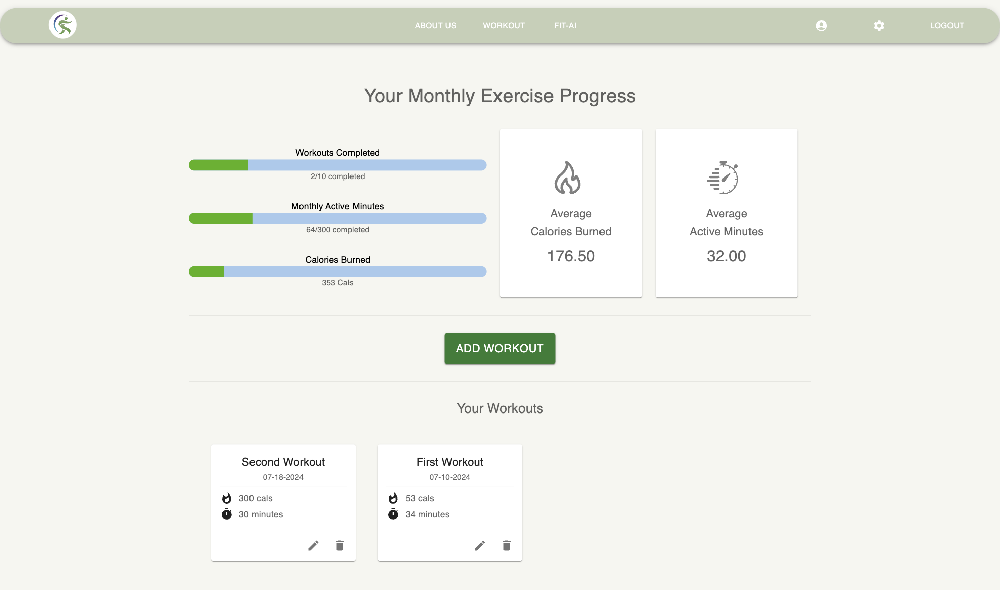
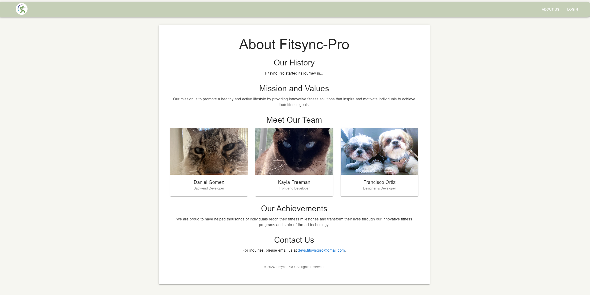
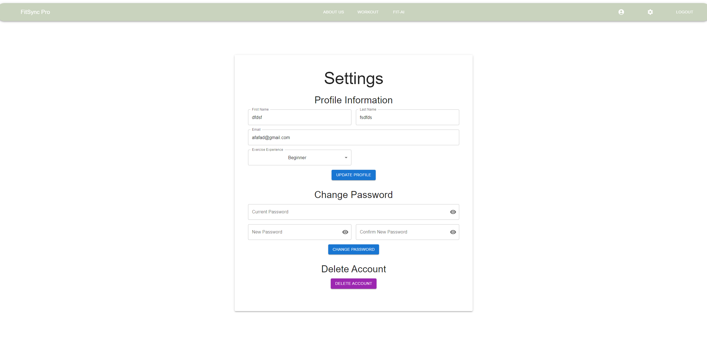
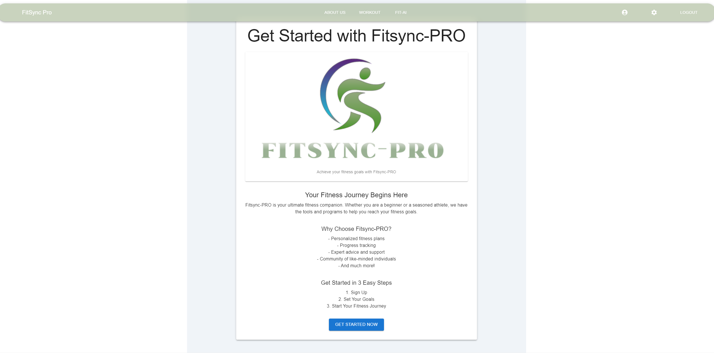

# FitSync-PRO

## Table of Contents
- [Introduction](#introduction)
- [Features](#features)
- [Installation](#installation)
- [Usage](#usage)
- [Pages Overview](#pages-overview)
  - [Workout Tracker](#workout-tracker)
  - [About Us](#about-us)
  - [Settings Page](#settings-page)
  - [Get Started Page](#get-started-page)
- [Screenshots](#screenshots)
- [Technologies](#technologies)
- [Contributing](#contributing)
- [License](#license)

## Introduction

FitSync-PRO is a comprehensive fitness application designed to help users track their workout progress, daily routines, exercise completion, and meal plans. This application provides a professional and engaging user experience, making it easier for individuals to stay on top of their fitness goals.

## Features

- **Progress Tracking**: Monitor workout completion, calories burned, and steps taken.
- **Exercise Progress**: Track individual exercises with target and completed metrics.
- **Daily Routines**: View daily workout routines with detailed descriptions and icons.
- **Weekly Calendar**: A weekly overview of planned routines and activities.
- **Professional Tracker**: Notifications for updates in workout plans, new exercises, and meal plans.
- **About Us**: Information about the FitSync-PRO team and company history.
- **Settings Page**: Allows users to update profile information, change passwords, and delete profiles.
- **Get Started Page**: A welcoming page for new users to get started with FitSync-PRO.

## Installation

1. Clone the repository:
    ```sh
    git clone https://github.com/your-username/fitsync-pro.git
    ```
2. Navigate to the project directory:
    ```sh
    cd fitsync-pro
    ```
3. Install dependencies:
    ```sh
    npm install
    ```

## Usage

1. Start the development server:
    ```sh
    npm start
    ```
2. Open your browser and navigate to `http://localhost:3000`.

## Pages Overview

### Workout Tracker

The Workout Tracker page helps users monitor their progress and track daily routines. It includes sections for:
- **Progress Tracking**: Linear progress bars showing workout completion, calories burned, and steps taken.
- **Exercise Progress**: Progress of individual exercises.
- **Weekly Calendar**: A calendar view of weekly routines.
- **Daily Routines**: Detailed descriptions and icons for each daily routine.
- **Professional Tracker**: Notifications for important updates and achievements.

### About Us

The About Us page provides information about the FitSync-PRO team and the company history. It includes:
- **Company History**: An overview of the company's journey.
- **Mission and Values**: The company's mission and core values.
- **Meet Our Team**: Profiles of the team members with images and roles.
- **Achievements**: Major milestones and achievements.
- **Contact Us**: Contact information and a form for inquiries.

### Settings Page

The Settings Page allows users to manage their account settings. It includes:
- **Update Profile Information**: Form to update user profile information.
- **Change Password**: Form to change the user's password with visibility toggle.
- **Danger Zone**: Option to delete the user profile.

### Get Started Page

The Get Started Page welcomes new users to FitSync-PRO. It includes:
- **Introduction to FitSync-PRO**: An overview of what the app offers.
- **Getting Started Instructions**: Steps to start using the app.
- **Visual Elements**: Engaging visuals to make the onboarding process enjoyable.

## Screenshots

### Workout Tracker


### About Us


### Settings Page


### Get Started Page


## Technologies

- **React**: A JavaScript library for building user interfaces.
- **Material-UI**: A popular React UI framework.
- **Framer Motion**: A library for animations in React.
- **Git**: Version control system.

## Contributing

1. Fork the repository.
2. Create a new branch:
    ```sh
    git checkout -b feature-name
    ```
3. Make your changes and commit them:
    ```sh
    git commit -m 'Add some feature'
    ```
4. Push to the branch:
    ```sh
    git push origin feature-name
    ```
5. Open a pull request.

## License

This project is licensed under the MIT License. See the [LICENSE](LICENSE) file for more details.
